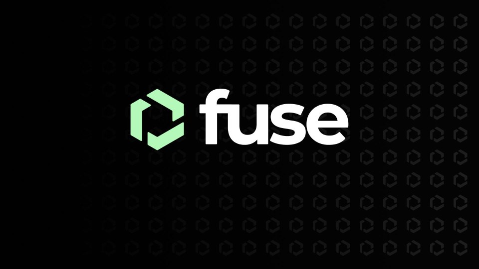

# FuseBox Readme



&nbsp;

FuseBox Web SDK is a powerful toolkit designed to streamline the integration of your applications with the Fuse Blockchain. Leveraging this SDK empowers developers to effortlessly create Smart Contract Wallets, initiate User Operations, and tap into the Fuse Notification and Trade APIs which are COMING to the SDK in the next release. With a comprehensive set of methods, FuseBox Web SDK simplifies the development process, facilitating efficient integration with the Fuse Network.

## Key Features of the FuseBox Web SDK

The FuseBox Web SDK all-in-one solution streamlines development, ensuring efficient integration with the Fuse Network.

### Smart Contract Wallet Initialization
The SDK simplifies the initializing of Smart Contract Wallets from an Externally Owned Account (EOA). Developers can easily manage wallet credentials and initiate Smart Contract Wallet creation. It is as seamless as running the code below:

### Wallet Action History Retrieval
Developers can retrieve the complete history of User Operations carried out by a Smart Contract Wallet. This feature enables seamless auditing and tracking of wallet activities.

### User Operation Transfers
The SDK facilitates sending User Operations, whether with or without a Paymaster. This flexibility allows developers to implement customizable transaction functionalities within their applications.

### Batch Transfers
Effortlessly batch multiple User Operations, such as swaps, using the callContract or executeBatch method. This feature simplifies complex transactions, enhancing the overall user experience.

### Notification Events - Coming Soon!
Leveraging webhooks, the SDK empowers developers to receive real-time Notification events. This is essential for building responsive applications that react to blockchain events.

### Trade APIs - Coming Soon!
The Trade APIs offer various methods, including obtaining current and historical prices of various assets, tracking price changes over defined intervals, retrieving token price change data, and executing swaps via the auxiliary Swap API.

## Installation
To integrate FuseBox Web SDK into your project, use npm:
```bash
npm install @fuseio/fusebox-web-sdk
```

## Getting Started
1. Import FuseBox Web SDK
```javascript
import { FuseSDK } from "@fuseio/fusebox-web-sdk";
```
2. Example Usage

`init`

```javascript
const main = async () => {
  const credentials = new ethers.Wallet(process.env.<YOUR_PRIVATE_KEY>);
  const publicApiKey = process.env.<YOUR_PUBLIC_API_KEY>;
  const fuseSDK = await FuseSDK.init(publicApiKey, credentials);
  const walletAddress = await fuseSDK.wallet.getSender();
  console.log(`Sender Address is ${walletAddress}`);
};
```

Ensure that `<YOUR_PRIVATE_KEY>` and `<YOUR_PUBLIC_API_KEY>` are replaced with your actual private key and public API key.

`callContract`

```javascript
const transfer = async () => {
    //You can use ethers.Wallet.createRandom to create a new Wallet.
    const credentials = new ethers.Wallet(process.env.<YOUR_PRIVATE_KEY>);
    const publicApiKey = process.env.<YOUR_PUBLIC_API_KEY>;
    const fuseSDK = await FuseSDK.init(publicApiKey, credentials, {
      withPaymaster: true,
    });

    // You can use any other "to" address and any other "value"
    const to = <RECEIVER_ADDRESS>;
    const value = parseEther("0");
    const data = Uint8Array.from([]);
    const res = await fuseSDK.callContract(to, value, data);
     
    console.log(`UserOpHash: ${res?.userOpHash}`);
    console.log("Waiting for transaction...");

    const receipt = await res?.wait();
    console.log("Transaction Hash:", receipt?.transactionHash);
    };
```

## Available Methods
`authenticate`- Authenticate a user using their private key and obtain a user token (JWT) for subsequent operations.

`init` - Initialize the FuseBox SDK with your API key.

`callContract` - Call a method on a smart contract deployed on the Fuse Network.

`executeBatch` - Execute a batch of transactions atomically.

`getBalance` - Retrieve the balance of a wallet.

`getAllowance` - Retrieve the allowance of a wallet.

`getERC20TokenDetails` - Retrieve details about an ERC-20 token.

## Documentation
For detailed information on each method and additional features, refer to the FuseBox Web SDK [Documentation](https://docs.fuse.io/docs/developers/fuse-box/fuse-sdk/).

## Support and Issues
For support or to report issues, please visit the Fuse Community [Forum](https://forum.fuse.io/).

## License
This project is licensed under the MIT License - see the LICENSE file for details.

This README provides a comprehensive overview of the FuseBox Web SDK. For in-depth information, consult the official [documentation](https://docs.fuse.io/docs/developers/fuse-box/fuse-sdk/).


